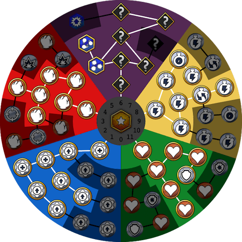

# Skullgirls Mobile Skill Tree Calculator

An interactive Skullgirls Mobile skill tree.



The SVG file can be embedded in other websites. It communicates data to the parent window and can receive instructions from the parent window.

## How to Use the SVG

0. (Optional) Save a copy of `sgmtree.svg` and the `sgmtree` folder.
1. In your HTML, include the SVG.
  - ```html
    <embed src="sgmtree.svg">
    ```
  - If you did not save a copy, replace `sgmtree.svg` with `https://krazete.github.io/sgmtree/sgmtree.svg`.
2. In your script, include a message event listener.
  - ```javascript
    window.addEventListener("message", onMessage);
    ```
3. In your message listener, filter requests by origin.
  - ```javascript
    function onMessage(e) {if (e.origin == window.origin) { /* CODE */ }}
    ```
  - If you did not save a copy, replace `window.origin` with `"https://krazete.github.io"`.
4. Handle the message data.
  - ```javascript
    {"sp": [], "cc": [], "th": [], "fs": 0, "at": 0, "hp": 0, "mandated": false}
    ```
  - `sp` and `cc` lists node costs if using only Skill Points and Canopy Coins.
  - `th` lists node costs if using only Theonite.
  - `fs`, `at`, and `hp` are the total Fighter Score multiplier, Attack multiplier, and Health multiplier.
    - See [Krazete/sgm#stats](https://github.com/Krazete/sgm#stats) for an explanation of the Fighter Score formula. Using that notation: `TREE_BOOST` would be 1 + `fs` / 100, `ATK_BOOST` would be 1 + `at` / 100, and `HP_BOOST` would be 1 + `hp` / 100.
  - `mandated` indicates whether the message was posted as a result of a mandate event.
5. (Optional) Check or uncheck nodes with the mandate event.
  - ```javascript
    svgDocument.dispatchEvent(new CustomEvent("mandate", {"detail": {"ids": [], "on": true}}));
    ```
  - `ids` is the list of node ids to affect.
  - `on` is true if checking nodes and false if unchecking nodes.

See `index.html` and `index.js` for an example of use.

## Notes

- Cost data was manually recorded for each node of each tier on my [SGM Skill Tree Costs](https://docs.google.com/spreadsheets/d/1his-ztPswmUIKaeAeO3a4pmihLn7LsssLTb-6Z3i350) spreadsheet.
- In the SVG file, nodes are named according to the counterclockwise direction, not tree order. E.g. `sa1` is actually the second tier of Signature Ability 1 while `sa2` is the first tier of Signature Ability 1.
- To test the message feature locally, you must open your HTML with a local server (e.g. Python's SimpleHTTPServer) due to CORS policy.
